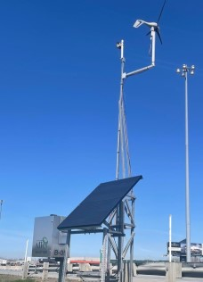

# This APP is still in development.

[HERE'S A VIDEO OF THE BETA VERSION OF THE APP                                        ](https://www.youtube.com/watch?v=XToImgI692Q)

# IoT Battery Monitoring

This is an app that monitors the battery data of two IoT devices.

This variable display :

And this traffic data collector : 

You can view the live state of the battery and also keep track of the past data to monitor the batteries behavior.
You can compare your equipments between each other to test performance.

## Getting Started

To install the required dependencies, you're gonna run `npm install` in all three folders of this project
`/server`
`/client`
`/cronjob`

For this app to work properly you need to add cronjobs to your ubuntu server.
- open a terminal and type `crontab -e`
- on the last line of the file add this line `*/10 * * * * node pathToThisProject/IoT-Battery-Monitoring/cronjob/index.js`

The database and the server must be running for the cronjob to work properly.

Start the server from the `/server` folder with `npx nodemon index.js`

Before starting the client side, verify that the first line in all five files in the `client/src/Services` folder are assigned the right IP address (this is only while this app is in development)

Start the client side with `npm start`

## Tech Stack

The front-end framework is **React.js**

The back-end server is **Koa**

The database is **PortgreSQL**

The Map API is **Google Map Platform**

The Weather data is provided by **OpenWeather**

The graph component is **Chart.js**